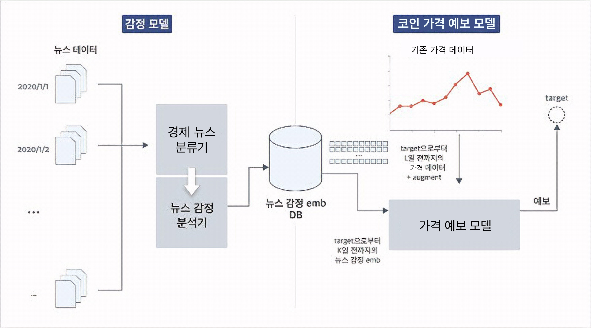

# Hypothesis
- [Task](#task)
- [Expected Flow](#expected-flow)
- [BERT for Regression](#bert-for-regression)

---

## Task
- 실시간 코인 데이터 + 코인 뉴스 데이터를 종합해 코인 가격 예측 모델 생성
- 코인 데이터(예상): 일/시/분 단위 시계열 데이터(float)
- 코인 뉴스 데이터(예상): 뉴스 작성 일자(datetime), 뉴스 헤드라인(str)

---

## Expected Flow

---

## BERT for Regression
- [DALL-E 원리](https://jiho-ml.com/weekly-nlp-40/)에 착안
- 뉴스 데이터에 대한 이해를 가지는 Encoder(BERT)와 시계열 데이터에 대한 이해를 가지는 Decoder를 Networking
- 경제 뉴스에 대해 학습된 FINBERT 등을 우선 시도해보고, ELECTRA 등의 모델에 뉴스 데이터를 fine-turing한 결과와 비교
- Decoder에서는 경제 뉴스 데이터 입력에 대한 +t 시점까지의 예상 가격을 반환
- 코인 가격에 대한 지속적인 강화학습을 시도하면 더욱 좋은 결과가 기대되지만, 강화학습에 대한 이해 부족으로 해당 부분 제외
- 관건은 뉴스 데이터와 시계열 데이터 간 시제를 맞추는 것
